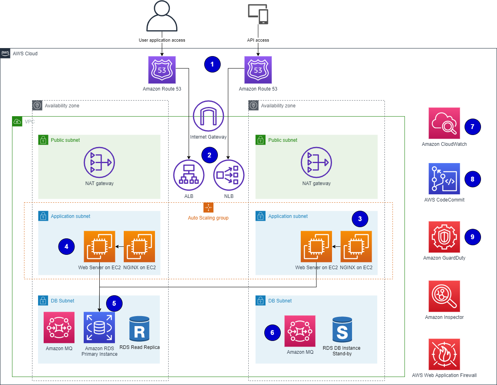
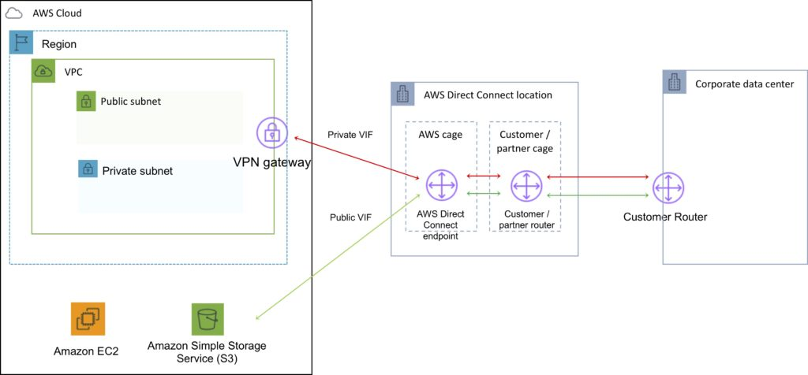

# SAP

* [PDF + VCE AWS Professional (update 03/13/2022)](https://drive.google.com/file/d/1uhXVPbGd9yXdCxtk0vCHdsIx_nP8czih/view?usp=sharing)
* [AWS Professional Exam Guide](https://drive.google.com/file/d/18gvHNZBv7xYTIjV1RKt-eMrXpwl4PTAd/view?usp=sharing)
* Video Training:
    * [Course on Linux Academy](https://drive.google.com/drive/folders/1_4eTGJtb2q-_LSjZ76CRp0mo9GQD0Pv0?usp=sharing)
    * [Cloud Guru](https://drive.google.com/drive/folders/1yy0d3pOkGn3wJ6Z19L_Ka_c23zLgNqM2?usp=sharing)

### Questions

Total 1018

1. [x] VPC NAT Gateway

    - Allow admin to access the application, database servers from the internet.
      
    - **Notes**:
        - [x] Put DB, App in different private subnets, Web (serve static content) in public subnet
        - [x] Create a NAT Gateway, Bastion Host in public subnet
        - [x] Add a route from private subnet to the public subnet having NAT Gateway

2. [ ] VPC connectivity
    - [ ] On-premises connect to VPC over [AWS Direct Connect (DX)](https://tutorialsdojo.com/aws-direct-connect/)
      

3. [x] IAM GROUP is a collection of users
4.
