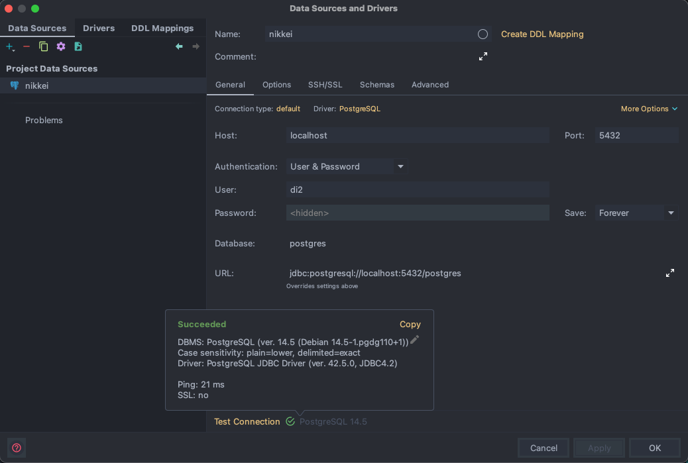
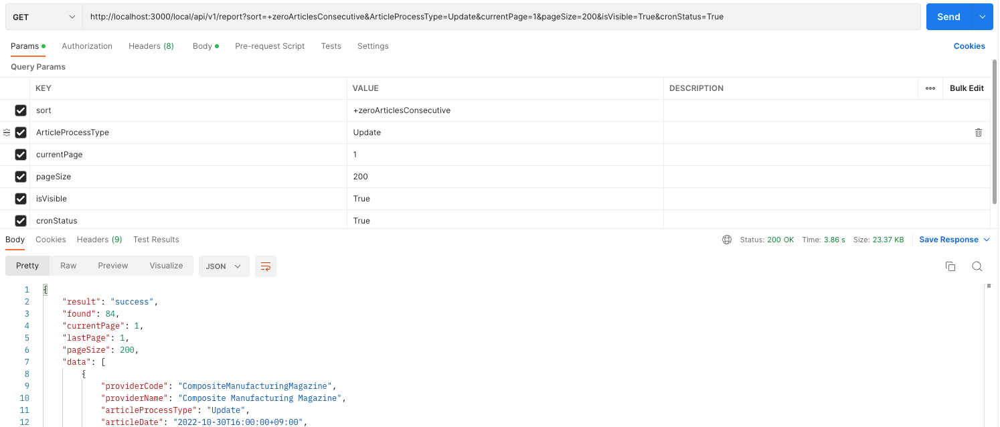
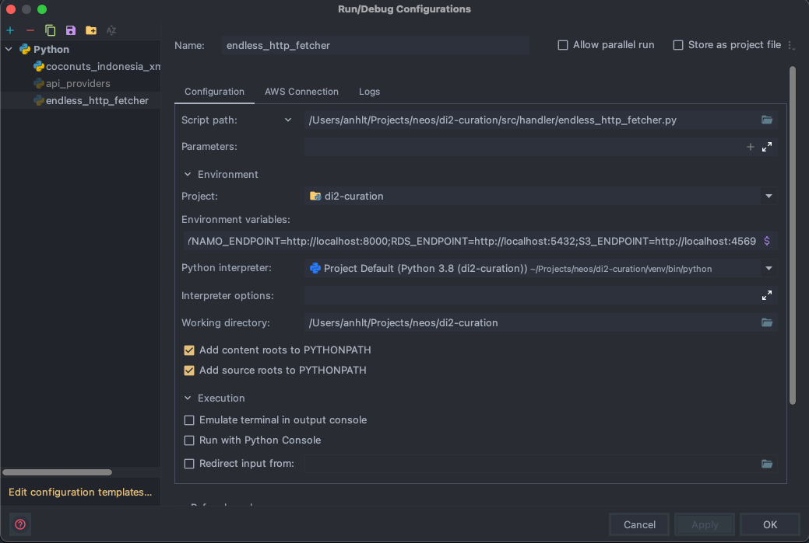

## Local development

---
- The ability to execute and debug code locally.
- Handling API calls to aws services locally.
- Unit testing.

---
### Installation

1. Prerequisite
   - [Docker](https://docs.docker.com/get-docker/)
   - [Python3.7](https://www.python.org/downloads/)
   - [NodeJS](https://nodejs.org/en/download/)
2. Install python requirement
    ```shell
    $ python3.7 -m virtualenv venv
    $ source venv/bin/activate
    $ pip install -r requirements/dev.txt
    ```
3. Install npm packages
    ```shell
    $ npm i
    ```
---
### Getting started
1. To run code and aws services on the local
    ```shell
    $ npm start

   Starting Offline at stage local (us-east-1)

    Offline [http for lambda] listening on http://localhost:3002
    Function names exposed for local invocation by aws-sdk:
               * LambdaFunction: articles
               * APIv2: articles_v2
               * APIProviders: api_providers
               * ScreenFetch: screen_fetch
               * ConstructionIndex: construction_index_xml_file_parser
               * DBMonitorLogs: db_monitor_report
               * FetchBSEIndiaScraper: bombay_stock_exchange_india_parser
               * FetchBSEIndiaScreenFetcher: bombay_stock_exchange_india_screen_fetch
               * FetchFTP: ftp_fetcher
               * FetchGoogle: google_screen_fetcher
               * FetchGoogleChildProcess: google_screen_fetcher_process
               * FetchGoogleParserProcess: google_parser_process
               * FetchGoogleScraper: google_parser
               * FetchHkex: hkex_fetcher
    ```
  `npm start` runs script `localstack/run.sh`. It contains following steps:
   - Export environment variables on `.env.local` file.
   - Start docker-compose (local-stack, dynamodb, dynamodb-gui, postgres).
   - Create rds table.
   - Create dynamodb table.
   - Upload config files to s3 bucket.
   - Start serverless-offline (s3, lambda, api-gateway)

---
### Documents
1. Frameworks
   - [Serverless Framework](https://www.serverless.com/plugins/serverless-offline)
   - [Local Stack](https://github.com/localstack/localstack)

2. AWS Services locally
   - [S3](https://docs.localstack.cloud/user-guide/aws/s3/)
     - Endpoint: http://localhost:4566
     - Check local s3 on `localstack/.data/s3`
     ```shell
     localstack/.data/s3/
     └── dev # Bucket name
         ├── {Provider}
         │    ├── config
         │    │    ├── config.json._S3rver_metadata.json
         │    │    ├── config.json._S3rver_object
         │    │    └── config.json._S3rver_object.md5
         │    └── source
         │        ├── Source_List.csv._S3rver_metadata.json
         │        ├── Source_List.csv._S3rver_object
         │        └── Source_List.csv._S3rver_object.md5
         ├── UAP
         └── config
             ├── Settings.json._S3rver_metadata.json
             ├── Settings.json._S3rver_object
             ├── Settings.json._S3rver_object.md5
             └── ...
     ```
     - List current buckets on the local
     ```shell
     $ aws s3 ls --endpoint http://localhost:4566
     2022-10-24 14:29:10 dev
     ```
     - [More available commands](https://docs.aws.amazon.com/cli/latest/reference/s3/index.html)
   - [SQS](https://docs.localstack.cloud/user-guide/aws/sqs/)
     - Endpoint: http://localhost:4566
     - List current queues on the local
     ```shell
     $ aws sqs list-queues --endpoint http://localhost:4566
     {
        "QueueUrls": [
            "http://localhost:4566/000000000000/google_scraper_queue",
            "http://localhost:4566/000000000000/monitor_logs_queue",
            "http://localhost:4566/000000000000/monitor_error_logs_queue",
            ...
        ]
     }
     ```
     - [More available commands](https://docs.aws.amazon.com/cli/latest/reference/sqs/index.html)
   - [SNS](https://docs.localstack.cloud/user-guide/aws/sns/)
     - Endpoint: http://localhost:4566
     - List current topics on the local
     ```shell
     $ aws sns list-topics --endpoint http://localhost:4566
     {
        "Topics": [
            {
                "TopicArn": "arn:aws:sns:us-east-1:000000000000:Nikkei-Publish-Topic"
            }
        ]
     }
     ```
     - [More available commands](https://docs.aws.amazon.com/cli/latest/reference/sns/index.html)
   - [DynamoDB](https://hub.docker.com/r/amazon/dynamodb-local/)
     - Endpoint: http://localhost:8000
     - List current tables on the local
     ```shell
     $ aws dynamodb list-tables --endpoint http://localhost:8000
     {
        "TableNames": [
            "ArchiveLogs",
            "DeletedArticles",
            "OriginArticles",
            "OriginMonitors"
        ]
     }
     ```
     - [More available commands](https://docs.aws.amazon.com/cli/latest/reference/dynamodb/index.html)
   - [RDS](https://hub.docker.com/_/postgres)
     - Endpoint: http://localhost:5432
     - RDS local actually is a postgres database, so it can't work with aws cli.
     - We can access the database with a database management (PgAdmin,...)
     - Configuration
       - Host: localhost
       - Port: 5432
       - User: root
       - Password: 12345678
       - Database: postgres

       

   - [Lambda Function](https://www.serverless.com/framework/docs/providers/aws/guide/functions)
     - Endpoint: http://localhost:3002
     - Invoke a function using serverless framework
       ```shell
       $ npx serverless invoke local --function $FunctionName --payload $Payload
       ```
     - Invoke a function using aws cli
       ```shell
       $ aws lambda invoke --endpoint-url http://localhost:3002 --function-name $FunctionName --payload $Payload
       ```
     - [More available commands](https://docs.aws.amazon.com/cli/latest/reference/lambda/index.html)
   - [API Gateway](https://www.serverless.com/framework/docs/providers/aws/events/apigateway)
     - Endpoint: http://localhost:3000
     - Postman example:

       
---
### CLI commands
- Export `.env.local`
    ```shell
    $ export $(xargs < "localstack/.env.local")
    ```
- Run a function as a script.

  _export .env.local is required_
    ```shell
    $ python ${functionPath}
    ```
---
### IDE
- Setup pycharm for debuging

  
